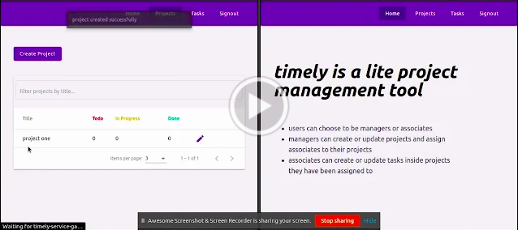

# Timely

**[link to app](https://timely-11.herokuapp.com/)**

## About

1. timely is a project management tool, to help a team with agile development
2. timely classifies its users as a "manager" or as an "associate". each team is expected to have a manager and several associates. during signup, users have the freedom to chose their role as either of the two
3. timely has two kinds of resources - "tasks" and "projects". a project can have several tasks, and a task can have the status of todo, in progress or done
4. managers can perform crud and assign any number of associates to projects they own. but managers can only read tasks which belong to their projects (not edit them)
5. associates can perform crud on tasks for projects they have been assigned to. but associates can only read projects they have been assigned to (not edit them)

## Demo

## Details

#### Microservices

1. each microservice registers itself with the eureka server, which helps in implementing service discovery pattern
2. services are reacheable through a gateway, for which spring cloud gateway has been used
3. services communicate with each other through a message broker (rabbitmq)
4. sleuth and zipkin have been used for distributed tracing

#### Authentication

1. firebase authentication has been used
2. microservices use the firebase admin sdk to be able to validate user tokens and perform rbac using OncePerRequestFilter
3. spring security has been used to authenticate and authorize requests
4. angular fire has been used to help with user sessions on frontend

#### Testing

1. junit and mockito have been used for unit and integartion tests on frontend
2. rest assured has been used for api testing
3. selenium has been used for end-to-end testing
4. test artifacts are generated by running using maven and uploaded using github actions

#### About Backend

1. OncePerRequestFilter helps in validating firebase tokens
2. each component has 3 environments - dev (for development), qa (for quality assurance) and prod (for production)
3. each service has enabled swagger-ui
4. project service handles crud of projects, and dispatche event to task service
5. task service handles crud of tasks
6. user service returns all users and helps adding custom role

#### About Frontend

1. ngrx has been used along with ngrx entity and ngrx effects for state management.
2. an interceptor adds firebase idToken to outgoing requests
3. route guards have been used for e.g. only users with role manager can visit edit page of project, only authenticated users can view list of projects, etc.
4. angular material has been used for components and tailwind for utilities like margin and padding.

#### Workflow

1. make a branch
2. make a pull request to qa
3. unit and integration tests are run by github actions
4. if successful, merge to qa
5. on merging to qa, the qa version is deployed to okteto
6. make merge request from qa to main
7. unit, integration, api and end-to-end tests are run by github actions
8. if successful, merge to main
9. on merging to main, the main version is deployed to heroku

#### Stack

1. angular
2. angular-material
3. docker
4. firebase (authentication)
5. github-actions
6. heroku
7. junit and mockito
8. ngrx (with ngrx-effects and ngrx-entity)
9. okteto
10. rabbitmq
11. rest-assured
12. selenium
13. spring-boot
14. spring-cloud
